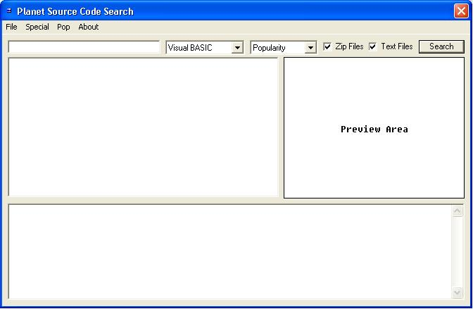



## A Planet Source Code Search App PSCSearch

### Description

An alternative way to browse Planet Source Code. Retrieves search results over HTTP, parses for specific data and displays it in a simple way. This app also allows display of preview screenshots within the program via a very useful function of User Controls.
 
### More Info
 
I haven't yet completed fully autonomous project downloading or code of the month parsing.

             |
---                |---
**Submitted On**   |2005-10-30 17:10:22
**By**             |[r\_t](https://github.com/Planet-Source-Code/PSCIndex/blob/master/ByAuthor/r-t.md)
**Level**          |Intermediate
**User Rating**    |4.9 (49 globes from 10 users)
**Compatibility**  |VB 6\.0
**Category**       |[Internet/ HTML](https://github.com/Planet-Source-Code/PSCIndex/blob/master/ByCategory/internet-html__1-34.md)
**World**          |[Visual Basic](https://github.com/Planet-Source-Code/PSCIndex/blob/master/ByWorld/visual-basic.md)
**Archive File**   |[PSCSearch\_19445110302005\.zip](https://github.com/Planet-Source-Code/r-t-a-planet-source-code-search-app-pscsearch__1-63076/archive/master.zip)

